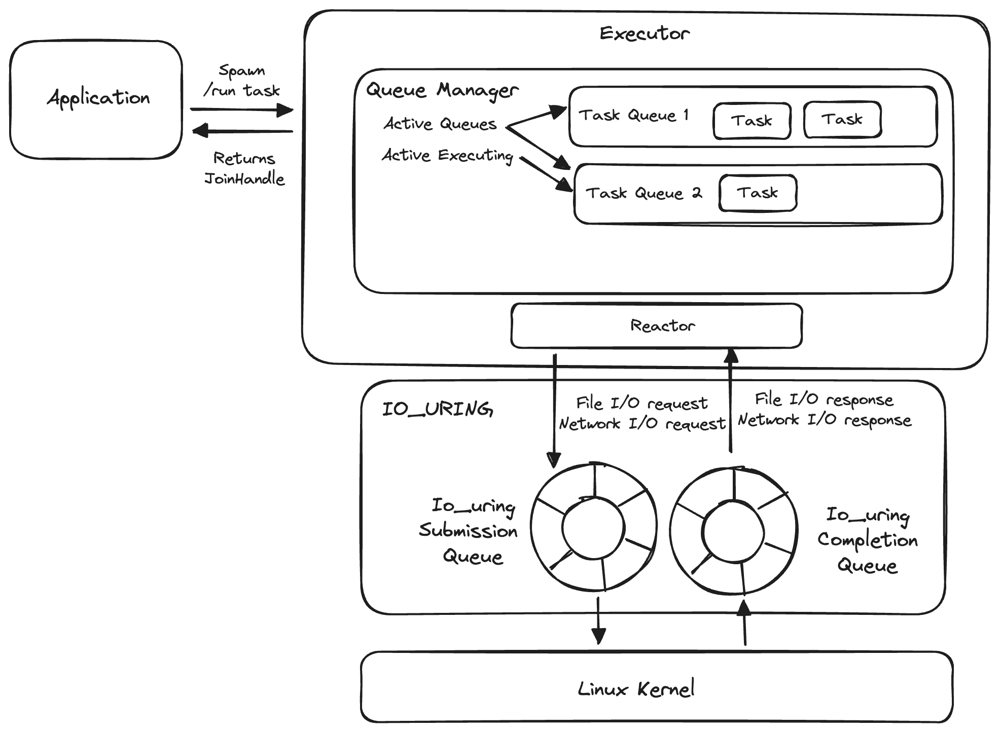

# Architecture

Here is the asynchronous runtime's architecture:

When the programmer spawns a `future` onto the executor, a `task` is created and a `JoinHandle` is returned to the user. 
The user can use the `JoinHandle` to consume the output of the completed task or cancel the task.

The spawned task is placed onto one of the task queues that the executor has. Each task queue holds a queue of tasks. 
A queue manager decides which task queue to run. In our V1, the queue manager will simply pick an arbitrary task queue to run at any moment.

We will cover asynchronous I/O and io_uring in Phase 2.

Next, let's perform a deep dive into the implementation details.