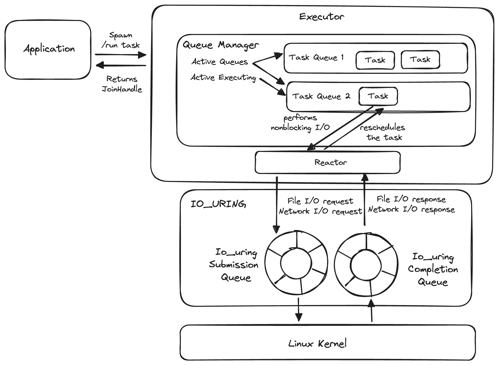

# Architecture

Here is a diagram of the asynchronous runtime's architecture:



Let's define the core abstractions:

### Task

A Task is the basic unit of work in an executor. A task is created by the `run` and `spawn_local` methods. The task keeps track of whether the provided `Future` is completed. It also tracks if the task is `canceled` or `closed` and deallocates itself from the memory if it’s no longer needed.

### Task Queue

Each TaskQueue holds a queue of `Task`. Right now, `TaskQueue` simply holds a list of Tasks. But in `Phase 4`, we will expose more advanced APIs that allow developers to specify roughly how the single-threaded executor should split up the CPU amongst the different task queues through the `shares` property.

### Queue Manager

A Queue Manager decides which Task Queue to run. At any point, the queue manager keeps track of which Task Queue is running. In this phase, the queue manager will simply pick an arbitrary task queue to run.


### Executor

The `Executor` is responsible for tracking and running a collection of `task`s. It’s responsible for switching between different tasks and performing multitasking.


### JoinHandle

When a task is spawned, the user needs a way to consume the output. This is what the `JoinHandle` does - it allows the user to consume the output of the task by calling `await`. The user can also cancel the task with the handle.

As shown in the example below, `spawn_local` returns a `JoinHandle` which can be `await`ed.

```rust
let handle = spawn_local(async { 1 + 3 });
let output = handle.await;
```

We will cover io_uring and asynchronous I/O in Phase 2.

Next, let's perform a deep dive into each of these core abstractions and look at their implementations.